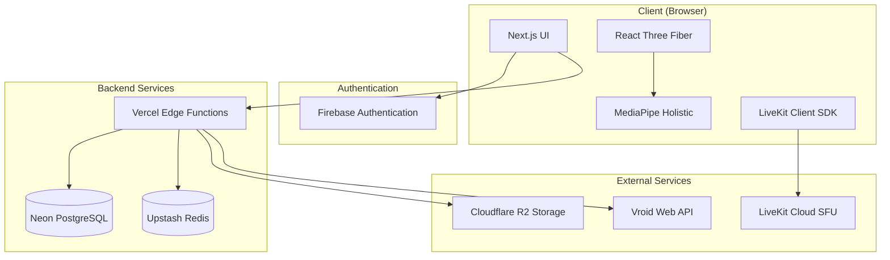

# Design Document

## Overview

V-Chatは、3Dアバター（V体）を使用したビデオチャットアプリケーションです。ユーザーは顔を隠しながらリアルタイムでコミュニケーションを取ることができます。本設計では、Next.js 15をベースとしたフロントエンド、Firebase Authenticationによる認証、LiveKitによるリアルタイム通信、React Three FiberとMediaPipeによる3D描画とモーションキャプチャを統合します。

**Figmaデザイン参照**: <https://www.figma.com/design/DTJ9Jwy5LTYN3KiW2Poxpm/V-Chat?node-id=0-1&t=wsYWw2Vgjr2JQQ0h-1>

## Architecture

### システム全体構成



### 技術スタック

**フロントエンド**

- Next.js 15 (App Router)
- React 19
- TypeScript
- Tailwind CSS + shadcn/ui
- React Three Fiber (3D描画)
- MediaPipe Holistic (モーションキャプチャ)
- LiveKit Client SDK (リアルタイム通信)
- Vroid Web API (V体モデル取得)

**バックエンド**

- Vercel Edge Functions (API)
- Neon PostgreSQL (データ永続化)
- Upstash Redis (マッチングキュー)

**外部サービス**

- Firebase Authentication (認証)
- LiveKit Cloud (SFU)
- Cloudflare R2 (VRMファイル保存)
- Vroid Web API (V体モデル提供)

## Components and Interfaces

### 主要コンポーネント構成

```
src/
├── app/
│   ├── (auth)/
│   │   ├── login/
│   │   └── register/
│   ├── (dashboard)/
│   │   ├── profile/
│   │   ├── matching/
│   │   └── room/[roomId]/
│   └── api/
│       ├── auth/
│       ├── matching/
│       ├── rooms/
│       └── vrm/
├── components/
│   ├── auth/
│   ├── avatar/
│   ├── matching/
│   ├── room/
│   └── ui/
├── lib/
│   ├── auth/
│   ├── livekit/
│   ├── mediapipe/
│   ├── three/
│   └── utils/
└── types/
```

### 核心コンポーネント

#### 1. Avatar System

```typescript
// components/avatar/VRMAvatar.tsx
interface VRMAvatarProps {
  vrmUrl: string;
  motionData?: MotionData;
  position?: [number, number, number];
}

// lib/three/VRMLoader.ts
class VRMLoader {
  async loadVRM(url: string): Promise<VRM>;
  applyMotion(vrm: VRM, motionData: MotionData): void;
}
```

#### 2. Motion Capture System

```typescript
// lib/mediapipe/MotionCapture.ts
interface MotionData {
  face: FaceLandmarks;
  pose: PoseLandmarks;
  hands: HandLandmarks[];
}

class MotionCapture {
  initialize(videoElement: HTMLVideoElement): Promise<void>;
  startCapture(): void;
  onMotionUpdate: (data: MotionData) => void;
}
```

#### 3. Room Management

```typescript
// lib/livekit/RoomManager.ts
class RoomManager {
  async createRoom(roomId: string): Promise<Room>;
  async joinRoom(roomId: string, token: string): Promise<Room>;
  async publishMotionData(data: MotionData): Promise<void>;
  onMotionDataReceived: (participantId: string, data: MotionData) => void;
}
```

#### 4. Matching System

```typescript
// lib/matching/MatchingService.ts
interface MatchingQueue {
  userId: string;
  preferences: MatchingPreferences;
  timestamp: number;
}

class MatchingService {
  async joinRandomQueue(userId: string): Promise<void>;
  async createSelectRoom(): Promise<string>;
  async joinSelectRoom(roomId: string): Promise<void>;
}
```

## Data Models

### User Model

```typescript
interface User {
  id: string;
  email: string;
  username: string;
  displayName: string;
  gender?: 'male' | 'female' | 'other';
  vrmId?: string;
  vrmUrl?: string;
  createdAt: Date;
  updatedAt: Date;
}
```

### Room Model

```typescript
interface Room {
  id: string;
  type: 'random' | 'select';
  participants: string[];
  maxParticipants: number;
  createdBy: string;
  createdAt: Date;
  expiresAt: Date;
  status: 'waiting' | 'active' | 'closed';
}
```

### VRM Model (Vroid Web API)

```typescript
// Vroid Web API types
interface Image {
  url: string;
  url2x: string | null;
  width: number;
  height: number;
}

interface PortraitImage {
  is_default_image: boolean;
  original: Image;
  w600: Image;
  w300: Image;
  sq600: Image;
  sq300: Image;
  sq150: Image;
}

interface FullBodyImage {
  is_default_image: boolean;
  original: Image;
  w600: Image;
  w300: Image;
}

interface UserIcon {
  is_default_image: boolean;
  sq170: Image;
  sq50: Image;
}

interface User {
  id: string;
  pixiv_user_id: string;
  name: string;
  icon: UserIcon;
}

interface Character {
  user: User;
  id: string;
  name: string;
  is_private: boolean;
  created_at: string;
  published_at: string | null;
}

interface CharacterModelVersion {
  id: string;
  created_at: string;
  spec_version: string | null;
  exporter_version: string | null;
  triangle_count: number;
  mesh_count: number;
  mesh_primitive_count: number;
  mesh_primitive_morph_count: number;
  material_count: number;
  texture_count: number;
  joint_count: number;
  is_vendor_forbidden_use_by_others: boolean;
  is_vendor_protected_download: boolean;
  is_vendor_forbidden_other_users_preview: boolean;
  original_file_size: number | null;
  vrm_meta: any;
  original_compressed_file_size: number | null;
  conversion_state?: ModelBasisConversionState;
  vendor_specified_license?: VendorSpecifiedLicense;
  attached_items?: AttachedItem[];
}

interface ModelBasisConversionState {
  current_state: 'pending' | 'processing' | 'completed' | 'failed';
}

interface VendorSpecifiedLicense {
  modification: 'default' | 'disallow' | 'allow';
  redistribution: 'default' | 'disallow' | 'allow';
  credit: 'default' | 'necessary' | 'unnecessary';
  characterization_allowed_user: 'default' | 'author' | 'everyone';
  sexual_expression: 'default' | 'disallow' | 'allow';
  violent_expression: 'default' | 'disallow' | 'allow';
  corporate_commercial_use: 'default' | 'disallow' | 'allow';
  personal_commercial_use: 'default' | 'disallow' | 'profit' | 'nonprofit';
}

interface AttachedItem {
  item_display_name: string;
  category_type: 'skin' | 'eyebrow' | 'nose' | 'mouth' | 'ear' | 'face_shape' | 'lip' | 'eye_surrounding' | 'eyeline' | 'eyelash' | 'iris' | 'eye_white' | 'eye_highlight' | 'base_hair' | 'all_hair' | 'hair_front' | 'hair_back' | 'whole_body' | 'head' | 'neck' | 'shoulder' | 'arm' | 'hand' | 'chest' | 'torso' | 'waist' | 'leg' | 'tops' | 'bottoms' | 'onepiece' | 'shoes' | 'inner' | 'socks' | 'neck_accessory' | 'arm_accessory' | 'safety' | 'cheek';
  downloadable: boolean;
  take_free: boolean;
  id: string;
  attached_item_coins: AttachedItemCoin[];
}

interface AttachedItemCoin {
  coin_type: 'apple' | 'google';
  price: number;
}

interface CharacterModelBoothItem {
  booth_item_id: number;
  part_category: string | null;
}

interface CharacterModelLicense {
  modification: 'default' | 'disallow' | 'allow';
  redistribution: 'default' | 'disallow' | 'allow';
  credit: 'default' | 'necessary' | 'unnecessary';
  characterization_allowed_user: 'default' | 'author' | 'everyone';
  sexual_expression: 'default' | 'disallow' | 'allow';
  violent_expression: 'default' | 'disallow' | 'allow';
  corporate_commercial_use: 'default' | 'disallow' | 'allow';
  personal_commercial_use: 'default' | 'disallow' | 'profit' | 'nonprofit';
}

interface Tag {
  name: string;
  locale: string | null;
  en_name: string | null;
  ja_name: string | null;
}

interface AgeLimit {
  is_r18: boolean;
  is_r15: boolean;
  is_adult: boolean;
}

interface CharacterModel {
  id: string;
  name: string | null;
  is_private: boolean;
  is_downloadable: boolean;
  is_comment_off: boolean;
  is_other_users_available: boolean;
  is_other_users_allow_viewer_preview: boolean;
  is_hearted: boolean;
  portrait_image: PortraitImage;
  full_body_image: FullBodyImage;
  license?: CharacterModelLicense;
  created_at: string;
  heart_count: number;
  download_count: number;
  usage_count: number;
  view_count: number;
  published_at: string | null;
  tags: Tag[];
  age_limit: AgeLimit;
  character: Character;
  latest_character_model_version?: CharacterModelVersion;
  character_model_booth_items: CharacterModelBoothItem[];
}

// Internal VRM Model for our application
interface VRMModel {
  id: string;
  vroidModelId: string;
  name: string;
  description: string;
  thumbnailUrl: string;
  vrmUrl: string;
  author: string;
  license: CharacterModelLicense;
  tags: Tag[];
  isPublic: boolean;
  ageLimit: AgeLimit;
}
```

### Motion Data Model

```typescript
interface MotionData {
  timestamp: number;
  face: {
    landmarks: number[][];
    expressions: Record<string, number>;
  };
  pose: {
    landmarks: number[][];
    visibility: number[];
  };
  hands: {
    left?: number[][];
    right?: number[][];
  };
}
```

## Database Schema

### PostgreSQL Tables

```sql
-- Users table
CREATE TABLE users (
  id UUID PRIMARY KEY DEFAULT gen_random_uuid(),
  email VARCHAR(255) UNIQUE NOT NULL,
  username VARCHAR(50) UNIQUE NOT NULL,
  display_name VARCHAR(100) NOT NULL,
  gender VARCHAR(10),
  vrm_id UUID,
  vrm_url TEXT,
  created_at TIMESTAMP DEFAULT NOW(),
  updated_at TIMESTAMP DEFAULT NOW()
);

-- Rooms table
CREATE TABLE rooms (
  id UUID PRIMARY KEY DEFAULT gen_random_uuid(),
  type VARCHAR(20) NOT NULL,
  max_participants INTEGER DEFAULT 2,
  created_by UUID REFERENCES users(id),
  created_at TIMESTAMP DEFAULT NOW(),
  expires_at TIMESTAMP,
  status VARCHAR(20) DEFAULT 'waiting'
);

-- Room participants table
CREATE TABLE room_participants (
  room_id UUID REFERENCES rooms(id),
  user_id UUID REFERENCES users(id),
  joined_at TIMESTAMP DEFAULT NOW(),
  PRIMARY KEY (room_id, user_id)
);

-- VRM models table
CREATE TABLE vrm_models (
  id UUID PRIMARY KEY DEFAULT gen_random_uuid(),
  name VARCHAR(100) NOT NULL,
  description TEXT,
  thumbnail_url TEXT,
  vrm_url TEXT NOT NULL,
  author VARCHAR(100),
  license VARCHAR(50),
  tags TEXT[],
  is_public BOOLEAN DEFAULT true,
  created_at TIMESTAMP DEFAULT NOW()
);
```

### Redis Data Structures

```typescript
// Matching queue (List)
// Key: "matching:random"
// Value: JSON.stringify({userId, preferences, timestamp})

// Active rooms (Hash)
// Key: "rooms:active"
// Field: roomId
// Value: JSON.stringify({participants, createdAt, expiresAt})

// User sessions (Hash)
// Key: "sessions:user:{userId}"
// Fields: {roomId, status, lastActivity}
```

## Error Handling

### エラー分類と対応

#### 1. 認証エラー

```typescript
class AuthError extends Error {
  constructor(message: string, public code: string) {
    super(message);
  }
}

// 対応: ログイン画面にリダイレクト、エラーメッセージ表示
```

#### 2. WebRTC接続エラー

```typescript
class ConnectionError extends Error {
  constructor(message: string, public retryable: boolean = true) {
    super(message);
  }
}

// 対応: 自動再接続、品質調整、ユーザー通知
```

#### 3. VRM読み込みエラー

```typescript
class VRMLoadError extends Error {
  constructor(message: string, public vrmUrl: string) {
    super(message);
  }
}

// 対応: デフォルトアバター表示、再試行オプション
```

#### 4. MediaPipeエラー

```typescript
class MotionCaptureError extends Error {
  constructor(message: string, public recoverable: boolean = true) {
    super(message);
  }
}

// 対応: カメラ権限確認、代替入力方法提示
```

### エラーハンドリング戦略

1. **グレースフルデグラデーション**: 機能が利用できない場合の代替手段
2. **自動復旧**: 一時的なエラーからの自動回復
3. **ユーザーフレンドリーなメッセージ**: 技術的詳細を隠した分かりやすいエラー表示
4. **ログ収集**: デバッグ用の詳細ログ記録

## Testing Strategy

### テスト構成

#### 1. Unit Tests

- **対象**: 個別コンポーネント、ユーティリティ関数
- **ツール**: Jest, React Testing Library
- **カバレッジ**: 80%以上

```typescript
// Example: VRMLoader unit test
describe('VRMLoader', () => {
  it('should load VRM file successfully', async () => {
    const loader = new VRMLoader();
    const vrm = await loader.loadVRM('/test.vrm');
    expect(vrm).toBeDefined();
  });
});
```

#### 2. Integration Tests

- **対象**: API エンドポイント、データベース操作
- **ツール**: Jest, Supertest
- **重点**: 認証フロー、マッチング機能

```typescript
// Example: Matching API integration test
describe('POST /api/matching/random', () => {
  it('should add user to matching queue', async () => {
    const response = await request(app)
      .post('/api/matching/random')
      .set('Authorization', `Bearer ${token}`)
      .expect(200);
    
    expect(response.body.status).toBe('queued');
  });
});
```

#### 3. E2E Tests

- **対象**: ユーザーフロー全体
- **ツール**: Playwright
- **シナリオ**: 登録→プロフィール設定→マッチング→通話

```typescript
// Example: E2E test scenario
test('complete user journey', async ({ page }) => {
  await page.goto('/register');
  await page.fill('[data-testid=email]', 'test@example.com');
  await page.click('[data-testid=register-button]');
  
  // Continue with profile setup and matching...
});
```

#### 4. Performance Tests

- **対象**: 3D描画パフォーマンス、WebRTC品質
- **ツール**: Lighthouse, WebRTC stats
- **指標**: FPS, レイテンシ, メモリ使用量

### テスト環境

1. **Development**: ローカル開発環境
2. **Staging**: 本番同等環境でのテスト
3. **Production**: 本番環境での監視とアラート

### CI/CD パイプライン

```yaml
# .github/workflows/test.yml
name: Test
on: [push, pull_request]
jobs:
  test:
    runs-on: ubuntu-latest
    steps:
      - uses: actions/checkout@v4
      - uses: actions/setup-node@v4
      - run: npm ci
      - run: npm run test:unit
      - run: npm run test:integration
      - run: npm run test:e2e
```

## Security Considerations

### セキュリティ対策

1. **認証・認可**
   - Firebase Authentication による安全な認証
   - JWT トークンの適切な管理
   - API エンドポイントの認証チェック

2. **データ保護**
   - HTTPS 通信の強制
   - 個人情報の暗号化
   - VRM ファイルのアクセス制御

3. **WebRTC セキュリティ**
   - TURN サーバーの認証
   - メディアストリームの暗号化
   - 不正アクセスの防止

4. **入力検証**
   - XSS 攻撃の防止
   - SQL インジェクション対策
   - ファイルアップロードの検証
