# V-Chat 統合アーキテクチャ図

## 現在のシステム概要アーキテクチャ

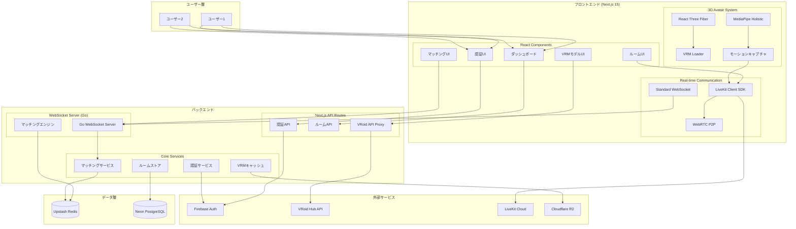

## 詳細コンポーネントアーキテクチャ

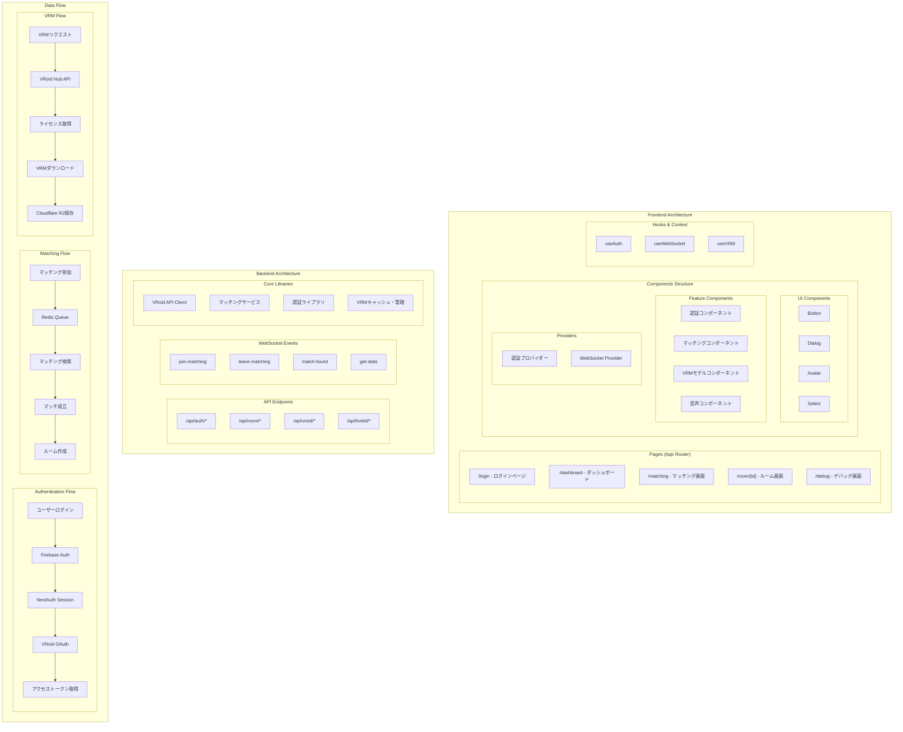

## 技術スタック詳細

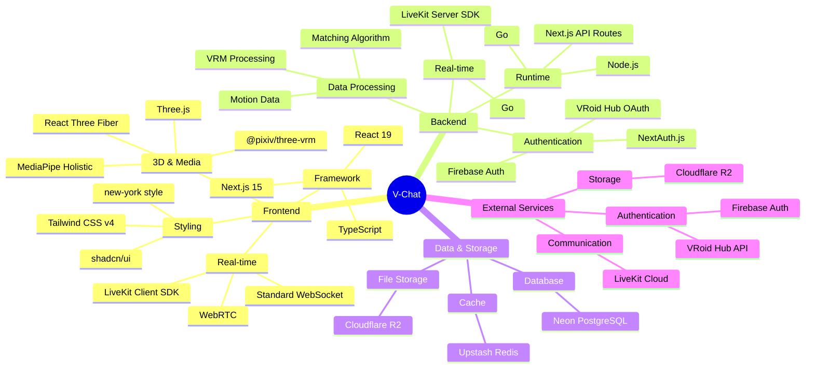

## データベース設計

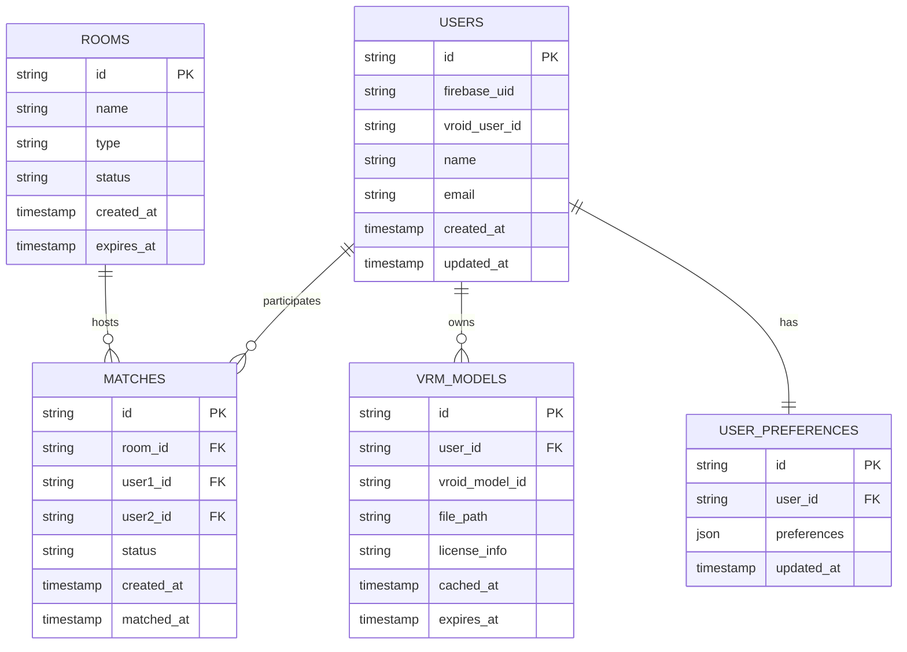

## システムの主要な特徴

### 1. マイクロサービス志向
- フロントエンド（Next.js）とWebSocketサーバー（Go）の分離
- 各機能ごとのサービス分離（認証、マッチング、VRM処理）

### 2. リアルタイム通信
- Go製WebSocketサーバーによるリアルタイム通信
- LiveKitによる音声・映像通信
- WebRTCによるP2P通信

### 3. 3Dアバターシステム
- VRM形式のサポート
- MediaPipeによるモーションキャプチャ
- React Three Fiberによる3D描画

### 4. 外部サービス統合
- VRoid Hub APIによるアバター取得
- Firebase Authenticationによる認証
- Cloudflare R2によるファイル保存

### 5. スケーラブルな設計
- Redis（Upstash）によるマッチングキュー
- PostgreSQL（Neon）による永続化
- LiveKit Cloudによる通信インフラ

---

## 将来構想を含む拡張アーキテクチャ

### フェーズ別機能展開

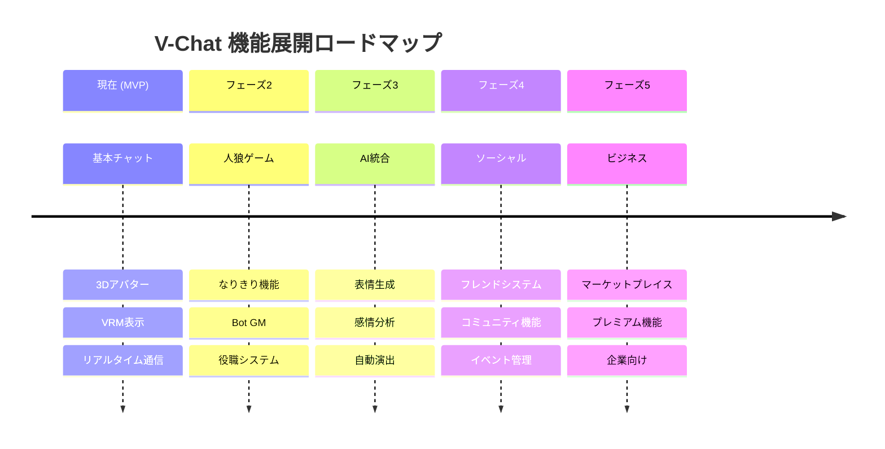

### 拡張システムアーキテクチャ

```mermaid
graph TB
    %% ユーザー層
    subgraph "多様なユーザー層"
        GeneralUser[一般ユーザー]
        GameUser[ゲーマー]
        Creator[クリエイター]
        Business[企業ユーザー]
    end
    
    %% フロントエンド統合プラットフォーム
    subgraph "統合フロントエンド プラットフォーム"
        subgraph "Core UI Components"
            ChatUI[チャットUI]
            AvatarUI[アバター管理UI]
            RoomUI[ルームUI]
            ProfileUI[プロフィールUI]
        end
        
        subgraph "Game Components (Phase 2)"
            WerewolfUI[人狼ゲームUI]
            RoleUI[役職管理UI]
            CharacterUI[キャラクター演技UI]
            GameStateUI[ゲーム状態UI]
        end
        
        subgraph "AI Enhanced Components (Phase 3)"
            AIExpressionUI[AI表情UI]
            EmotionUI[感情分析UI]
            AutoDirectionUI[自動演出UI]
        end
        
        subgraph "Social Components (Phase 4)"
            FriendUI[フレンドUI]
            CommunityUI[コミュニティUI]
            EventUI[イベント管理UI]
        end
        
        subgraph "Business Components (Phase 5)"
            MarketplaceUI[マーケットプレイスUI]
            PremiumUI[プレミアム機能UI]
            AdminUI[管理者UI]
        end
        
        subgraph "3D Avatar System Enhanced"
            R3F[React Three Fiber]
            VRMAdvanced[高度なVRMシステム]
            AIMotion[AI表情・動作生成]
            CustomAvatar[カスタムアバター]
        end
    end
    
    %% マイクロサービスバックエンド
    subgraph "マイクロサービス バックエンド"
        subgraph "Core Services"
            AuthService[認証サービス]
            UserService[ユーザー管理]
            ChatService[チャット管理]
            RoomService[ルーム管理]
        end
        
        subgraph "Game Services (Phase 2)"
            WerewolfEngine[人狼ゲームエンジン]
            GameBotService[ゲームBot GM]
            RoleService[役職管理]
            CharacterService[キャラクター管理]
        end
        
        subgraph "AI Services (Phase 3)"
            EmotionAnalysis[感情分析AI]
            ExpressionGenerator[表情生成AI]
            MotionAI[モーション生成AI]
            AIOrchestrator[AI統合管理]
        end
        
        subgraph "Social Services (Phase 4)"
            FriendService[フレンド管理]
            CommunityService[コミュニティ管理]
            EventService[イベント管理]
            NotificationService[通知サービス]
        end
        
        subgraph "Business Services (Phase 5)"
            MarketplaceService[マーケットプレイス]
            PaymentService[決済サービス]
            AnalyticsService[分析サービス]
            AdminService[管理サービス]
        end
    end
    
    %% 多層データベース戦略
    subgraph "多層データベース戦略"
        subgraph "Primary Storage"
            PostgreSQL[(PostgreSQL Main)]
            TimescaleDB[(TimescaleDB Analytics)]
        end
        
        subgraph "Cache & Queue"
            RedisCluster[(Redis Cluster)]
            GameStateCache[(Game State Cache)]
        end
        
        subgraph "Specialized Storage"
            VectorDB[(Vector DB for AI)]
            GraphDB[(Graph DB for Social)]
            TSDB[(Time Series for Metrics)]
        end
        
        subgraph "File Storage"
            CloudflareR2[(Cloudflare R2)]
            CDN[(Global CDN)]
        end
    end
    
    %% 外部AI・サービス統合
    subgraph "外部AI・サービス統合"
        OpenAIAPI[OpenAI API]
        StabilityAI[Stability AI]
        GoogleAI[Google AI]
        AWSComprehend[AWS Comprehend]
        
        StripeAPI[Stripe API]
        PayPalAPI[PayPal API]
        
        DiscordBot[Discord Bot]
        TwitterAPI[Twitter API]
        LineAPI[Line API]
    end
    
    %% 接続関係
    GeneralUser --> ChatUI
    GameUser --> WerewolfUI
    Creator --> MarketplaceUI
    Business --> AdminUI
    
    ChatUI --> ChatService
    WerewolfUI --> WerewolfEngine
    AIExpressionUI --> EmotionAnalysis
    MarketplaceUI --> MarketplaceService
    
    EmotionAnalysis --> OpenAIAPI
    ExpressionGenerator --> StabilityAI
    PaymentService --> StripeAPI
    
    ChatService --> PostgreSQL
    WerewolfEngine --> GameStateCache
    EmotionAnalysis --> VectorDB
    FriendService --> GraphDB
```

### ゲームシステム詳細アーキテクチャ（人狼機能）

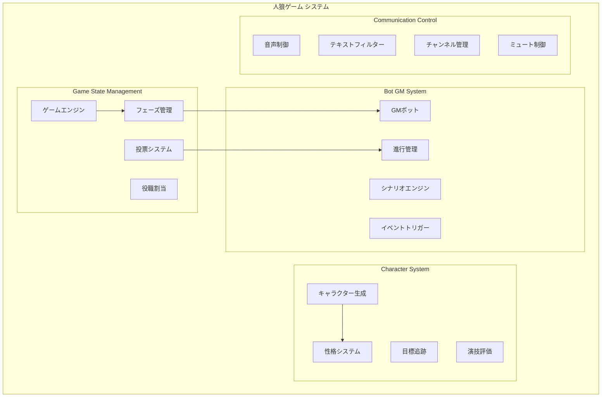

### AIシステム詳細アーキテクチャ

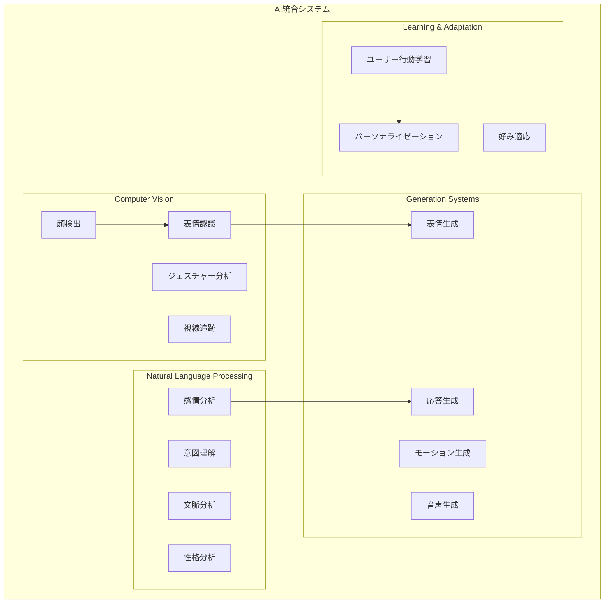

### ビジネス・マーケットプレイス アーキテクチャ

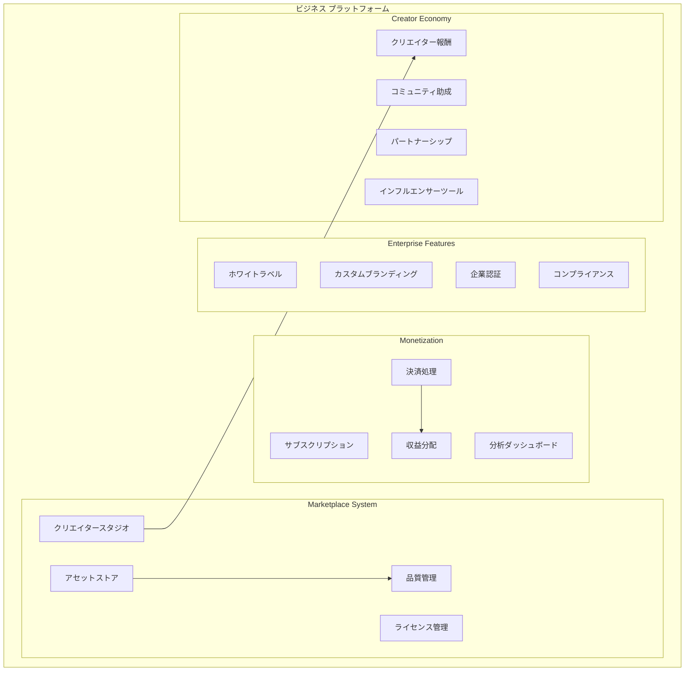

### インフラストラクチャ・スケーリング戦略

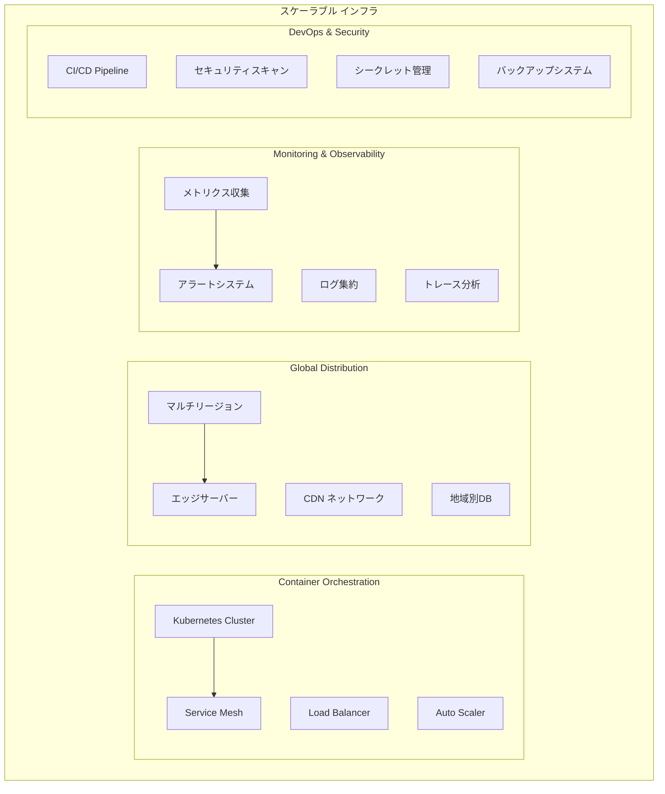

## 技術的実装戦略

### フェーズ別実装計画

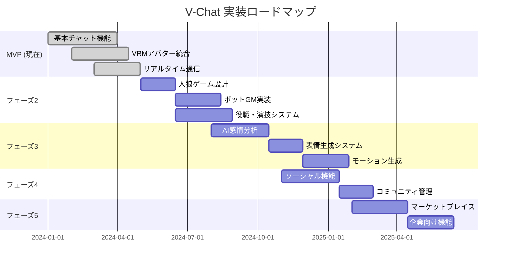

### API設計拡張

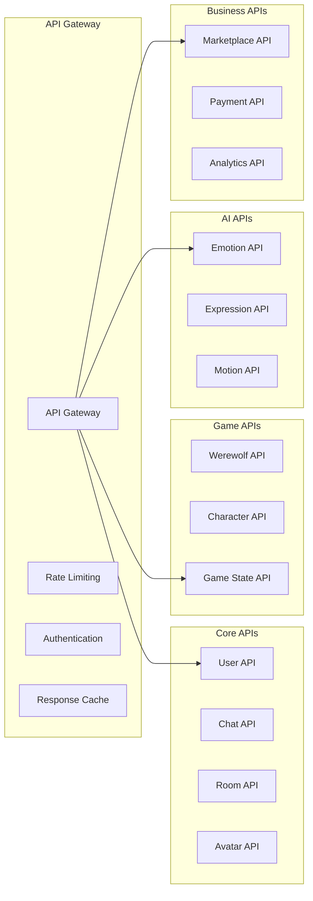

この拡張アーキテクチャにより、V-Chatは単純なビデオチャットアプリから、包括的なメタバースプラットフォームへと進化できる基盤が構築されます。