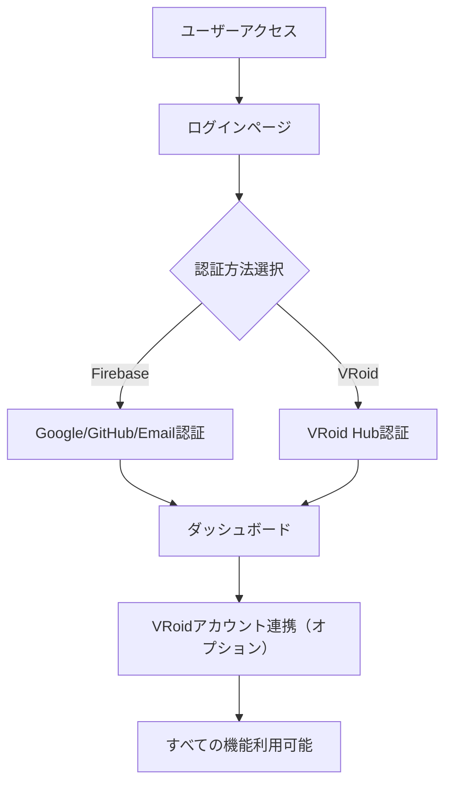
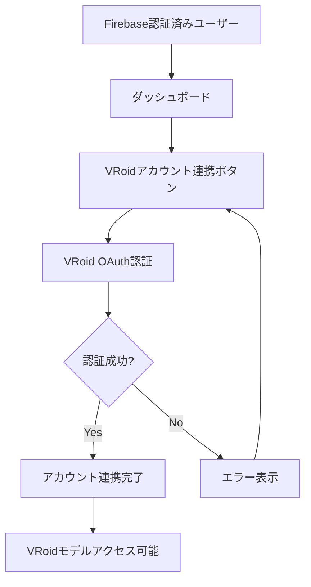

# V-Chat 認証システム

## 概要

V-Chatでは、ユーザーの利便性と機能拡張性を考慮したハイブリッド認証システムを採用しています。Firebase AuthenticationとNextAuth.jsを組み合わせることで、従来の認証方法とVRoid Hub OAuth認証の両方をサポートしています。

## アーキテクチャ

### 認証プロバイダー

#### 1. Firebase Authentication（プライマリ認証）
- **Google認証**
- **GitHub認証**
- **Email/Password認証**

#### 2. NextAuth.js（セカンダリ連携）
- **VRoid Hub OAuth認証**

### システム設計

```
┌─────────────────────────────────────────────────────────┐
│                    認証システム                          │
├─────────────────────────────────────────────────────────┤
│  AuthContext                                           │
│  ├── Firebase Authentication (メイン認証)                │
│  └── NextAuth.js (VRoid連携)                          │
├─────────────────────────────────────────────────────────┤
│  認証状態管理                                           │
│  ├── user: Firebase User | null                       │
│  ├── nextAuthSession: NextAuth Session | null         │
│  └── isVRoidLinked: boolean                           │
└─────────────────────────────────────────────────────────┘
```

## 実装詳細

### 1. AuthContext (/src/contexts/AuthContext.tsx)

認証システムの中核となるコンテキスト。Firebase認証とNextAuth認証の両方を管理します。

#### 主要な状態

```typescript
interface AuthContextType {
  // 認証状態
  user: User | null;                    // Firebase ユーザー
  nextAuthSession: any;                 // NextAuth セッション
  loading: boolean;                     // ロード状態
  
  // Firebase認証メソッド
  login: (email: string, password: string) => Promise<void>;
  register: (email: string, password: string, displayName: string) => Promise<void>;
  loginWithGoogle: () => Promise<void>;
  loginWithGithub: () => Promise<void>;
  
  // アカウントリンク機能
  linkVRoidAccount: () => Promise<void>;    // VRoidアカウント連携
  unlinkVRoidAccount: () => Promise<void>;  // VRoid連携解除
  isVRoidLinked: boolean;                   // VRoid連携状態
  
  // 共通メソッド
  logout: () => Promise<void>;
  resetPassword: (email: string) => Promise<void>;
  sendVerificationEmail: () => Promise<void>;
}
```

#### VRoidアカウントリンク機能

```typescript
// VRoidアカウントをリンク
const linkVRoidAccount = async () => {
  if (!user) {
    throw new Error('Firebase認証が必要です。先にログインしてください。');
  }

  try {
    const result = await signIn('vroid', {
      redirect: false,
      callbackUrl: '/dashboard'
    });

    if (result?.error) {
      throw new Error('VRoidアカウントの連携に失敗しました');
    }

    setLinkedAccounts(prev => [...prev.filter(acc => acc !== 'vroid'), 'vroid']);
    console.log('VRoidアカウント連携完了');
  } catch (error: any) {
    throw new Error(error.message);
  }
};
```

### 2. NextAuth設定 (/src/lib/auth.ts)

VRoid Hub OAuth認証の詳細設定を管理します。

#### VRoidプロバイダー設定

```typescript
{
  id: 'vroid',
  name: 'VRoid Hub',
  type: 'oauth',
  authorization: {
    url: 'https://hub.vroid.com/oauth/authorize',
    params: {
      scope: 'default',
      response_type: 'code',
    },
  },
  token: 'https://hub.vroid.com/oauth/token',
  userinfo: {
    url: 'https://hub.vroid.com/api/account',
    async request({ tokens, provider }) {
      const response = await fetch('https://hub.vroid.com/api/account', {
        headers: {
          'X-Api-Version': '11',
          'Authorization': `Bearer ${tokens.access_token}`,
        },
      });
      
      if (!response.ok) {
        throw new Error(`VRoid API error: ${response.status}`);
      }
      
      return await response.json();
    }
  },
  clientId: process.env.VROID_CLIENT_ID,
  clientSecret: process.env.VROID_CLIENT_SECRET,
}
```

### 3. ProtectedRoute (/src/components/auth/ProtectedRoute.tsx)

認証が必要なページを保護するコンポーネント。両方の認証方法をサポートします。

```typescript
export default function ProtectedRoute({ 
  children, 
  requireAuth = true, 
  redirectTo = '/login' 
}: ProtectedRouteProps) {
  const { user, nextAuthSession, loading } = useAuth();
  
  // Firebase または NextAuth のいずれかで認証されているかチェック
  const isAuthenticated = user || nextAuthSession;

  useEffect(() => {
    if (!loading) {
      if (requireAuth && !isAuthenticated) {
        router.push(redirectTo);
      } else if (!requireAuth && isAuthenticated) {
        router.push('/dashboard');
      }
    }
  }, [isAuthenticated, loading, requireAuth, redirectTo, router]);

  // ...
}
```

### 4. ダッシュボードUI (/src/app/dashboard/page.tsx)

ユーザーがVRoidアカウントを連携・管理できるインターフェース。

#### VRoidアカウント連携カード

```tsx
<Card>
  <CardHeader>
    <CardTitle>VRoidアカウント連携</CardTitle>
    <CardDescription>
      VRoidモデルを使用するためにアカウントを連携します
    </CardDescription>
  </CardHeader>
  <CardContent>
    {isVRoidLinked ? (
      <div className="space-y-2">
        <div className="flex items-center space-x-2">
          <div className="w-3 h-3 bg-green-500 rounded-full"></div>
          <span className="text-sm text-green-600">VRoidアカウント連携済み</span>
        </div>
        <Button onClick={handleUnlinkVRoid} variant="outline" className="w-full">
          連携を解除
        </Button>
      </div>
    ) : (
      <div className="space-y-2">
        <div className="flex items-center space-x-2">
          <div className="w-3 h-3 bg-gray-300 rounded-full"></div>
          <span className="text-sm text-gray-600">VRoidアカウント未連携</span>
        </div>
        <Button 
          onClick={handleLinkVRoid}
          className="w-full bg-gradient-to-r from-purple-500 to-pink-500 text-white hover:from-purple-600 hover:to-pink-600"
        >
          VRoidアカウントを連携
        </Button>
      </div>
    )}
  </CardContent>
</Card>
```

## 使用フロー

### 1. 新規ユーザー登録フロー



### 2. アカウントリンクフロー



### 3. 認証状態の判定

```typescript
// 認証されているかの判定
const isAuthenticated = user || nextAuthSession;

// VRoidが連携されているかの判定
const isVRoidLinked = nextAuthSession?.provider === 'vroid' || linkedAccounts.includes('vroid');

// メインアカウントの情報取得
const currentUser = user || nextAuthSession?.user;
```

## 環境変数設定

### Firebase設定

```env
NEXT_PUBLIC_FIREBASE_API_KEY=your_firebase_api_key
NEXT_PUBLIC_FIREBASE_AUTH_DOMAIN=your_project.firebaseapp.com
NEXT_PUBLIC_FIREBASE_PROJECT_ID=your_project_id
NEXT_PUBLIC_FIREBASE_STORAGE_BUCKET=your_project.firebasestorage.app
NEXT_PUBLIC_FIREBASE_MESSAGING_SENDER_ID=your_sender_id
NEXT_PUBLIC_FIREBASE_APP_ID=your_app_id
NEXT_PUBLIC_FIREBASE_MEASUREMENT_ID=your_measurement_id
```

### NextAuth設定

```env
NEXTAUTH_URL=http://localhost:3000
NEXTAUTH_SECRET=your_secret_key_change_in_production
NEXTAUTH_DEBUG=true
```

### VRoid Hub設定

```env
VROID_CLIENT_ID=your_vroid_client_id
VROID_CLIENT_SECRET=your_vroid_client_secret
```

## VRoid Hub開発者コンソール設定

### 必要な設定

1. **VRoid Hub開発者登録**: https://hub.vroid.com/oauth/applications/
2. **アプリケーション作成**:
   - Application Name: V-Chat
   - Redirect URI: `http://localhost:3000/api/auth/callback/vroid`
   - Scopes: `default`
   - Service URL: `http://localhost:3000/`

### 取得する情報

- **Application ID**: `VROID_CLIENT_ID`として使用
- **Application Secret**: `VROID_CLIENT_SECRET`として使用

## セキュリティ考慮事項

### 1. セッション管理

- Firebase認証はサーバーサイドでも検証可能
- NextAuthセッションはJWTベースで管理
- 両方のセッションが独立して動作

### 2. スコープ制限

- VRoid認証は最小限のスコープ（default）のみ要求
- ユーザーのVRoidモデルアクセスに必要な権限のみ取得

### 3. エラーハンドリング

```typescript
try {
  await linkVRoidAccount();
} catch (error: any) {
  console.error('VRoid連携エラー:', error);
  // ユーザーフレンドリーなエラーメッセージを表示
  alert(error.message);
}
```

## トラブルシューティング

### よくある問題

#### 1. VRoid OAuth認証エラー

**問題**: AccessDenied エラー
**解決策**: 
- VRoid Hub開発者コンソールでRedirect URIが正確に設定されているか確認
- Client IDとClient Secretが正しいか確認

#### 2. 認証状態の同期問題

**問題**: ログイン後に /login にリダイレクトされる
**解決策**: 
- `ProtectedRoute`が両方の認証方法を考慮しているか確認
- `isAuthenticated = user || nextAuthSession`の判定が正しく動作しているか確認

#### 3. 環境変数の読み込み問題

**問題**: 環境変数が undefined になる
**解決策**: 
- `.env.local`ファイルが正しい場所にあるか確認
- 開発サーバーを再起動
- ブラウザのキャッシュをクリア

## 今後の拡張予定

### 1. データベース統合

- ユーザープロフィール情報の永続化
- アカウント連携情報の保存
- VRoidモデル情報のキャッシュ

### 2. 追加プロバイダー

- Discord認証
- Twitter認証
- その他のVRMプラットフォーム連携

### 3. 高度な機能

- アカウントマージ機能
- 複数VRoidアカウントの管理
- 認証履歴の追跡

## 参考資料

- [Firebase Authentication Documentation](https://firebase.google.com/docs/auth)
- [NextAuth.js Documentation](https://next-auth.js.org/)
- [VRoid Hub API Documentation](https://developer.vroid.com/en/api/)
- [OAuth 2.0 Specification](https://oauth.net/2/)