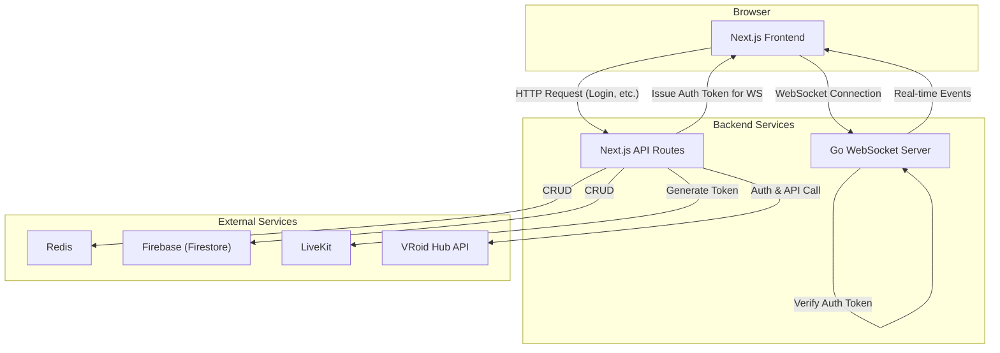

# バックエンドアーキテクチャ & 戦略

このドキュメントは、V-Chatアプリケーションのバックエンドアーキテクチャ、特にリアルタイム通信機能の設計、技術選定、デプロイ戦略について説明します。

## 1. アーキテクチャ概要

V-Chatのバックエンドは、**Next.js API Routes** と **独立したGo製WebSocketサーバー** を組み合わせたハイブリッド構成を採用します。

-   **Next.js API Routes**: ステートレスなHTTPリクエストを処理します。ユーザー認証、データ取得、ルーム作成のトリガーなど、従来のRESTful APIが担う役割を果たします。
-   **WebSocketサーバー (Go)**: ステートフルな双方向通信を管理します。アバターの位置同期、チャットメッセージ、ルーム内のイベント通知など、リアルタイム性が求められる機能を提供します。

## 2. 技術スタック

-   **フレームワーク**: Next.js
-   **リアルタイム通信**: **Go** (`nhooyr.io/websocket`ライブラリ)
-   **データベース**:
    -   **Redis**: ルームの状態、参加者リストなど、揮発性・リアルタイム性の高いデータを管理。
    -   **Firebase (Firestore)**: ユーザーアカウントなど、永続性が必要なデータ。
-   **認証**: NextAuth.js (HTTPセッション), JWT (WebSocket認証)

## 3. 技術選定の背景

### リアルタイムサーバー: Goの採用

当初のSocket.IO (Node.js) ベースの実装から、パフォーマンスとスケーラビリティを重視して**Go**言語ベースのサーバーに移行する方針としました。

-   **理由:**
    -   **高いパフォーマンス:** Goは軽量な並行処理（ゴルーチン）を得意とし、多数の同時接続を効率的に処理できます。
    -   **シングルバイナリ:** コンパイル後の成果物が単一の実行ファイルであり、コンテナイメージを非常に小さく（<20MB）できるため、デプロイと起動（コールドスタート）が高速になります。

## 4. デプロイ戦略

### プラットフォーム: Google Cloud Run

-   **理由:**
    -   コンテナベースのデプロイが容易。
    -   サーバーレスであり、インフラ管理の手間が少ない。
    -   従量課金制でコスト効率が高い。

### 構成: スケールトゥゼロ (Scale to Zero)

-   **設定:** `min-instances: 0`（最小インスタンス数 = 0）
-   **目的:** **コストの最小化**を最優先します。
-   **トレードオフ:** この設定により、アクティブなユーザーがいない場合、サーバーのインスタンス数は0になります。その状態から最初のユーザーが接続を試みると、インスタンスの起動（コールドスタート）のために**数秒の遅延が発生します。** このユーザー体験の低下を許容し、コストメリットを享受する戦略です。

## 5. 認証フロー

1.  **HTTP認証**: ユーザーはNextAuth.jsを介して認証します。
2.  **WebSocket用トークン発行**: ユーザーがリアルタイム通信を開始する際、Next.jsのAPIルートが短命のJWT（JSON Web Token）を生成してクライアントに渡します。
3.  **WebSocket接続と認証**:
    -   クライアントは、GoのWebSocketサーバーに接続する際、このJWTを認証情報として送信します。
    -   Goサーバーは、公開鍵などを用いてJWTの署名を検証し、接続を許可します。

## 6. 実装ファイル

-   `go-server/main.go`: Go製WebSocketサーバーのメインファイル。
-   `go-server/Dockerfile`: サーバーをコンテナ化するためのDockerfile。
-   `src/lib/socket-client.ts`: フロントエンド用のWebSocketクライアント設定。
