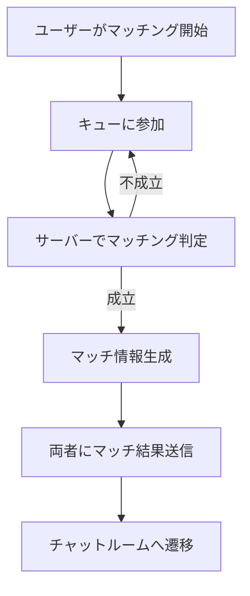

# ランダムマッチング機能 実装ガイド

## 概要

本ドキュメントでは、V-Chatにおけるランダムマッチング機能の実装方法について解説します。ユーザー同士がランダムにマッチングし、チャットルームで会話できる仕組みを、バックエンド・フロントエンド双方の観点から説明します。

---

## システム構成

- **バックエンド**: Redisを用いたマッチングキュー管理、マッチ生成、状態管理
- **フロントエンド**: WebSocketによるリアルタイム通信、UI表示、ユーザー操作
- **主な技術**: Next.js, TypeScript, Redis, WebSocket

---

## 主な型定義

```ts
// MatchingUser: マッチングキューに入るユーザー情報
interface MatchingUser {
  userId: string;
  socketId: string;
  timestamp: number;
  preferences?: {
    ageRange?: [number, number];
    interests?: string[];
    gender?: 'male' | 'female' | 'any';
    maxWaitTime?: number;
  };
  userInfo?: {
    name: string;
    age?: number;
    interests?: string[];
  };
}

// Match: マッチング成立時の情報
interface Match {
  id: string;
  users: [string, string];
  socketIds: [string, string];
  createdAt: Date;
  status: 'active' | 'ended' | 'disconnected';
  roomId?: string;
}

// MatchingResult: フロントエンドに返すマッチ結果
interface MatchingResult {
  matchid: string;
  partner: {
    userId: string;
    name: string;
    age?: number;
    interests?: string[];
  };
  roomId: string;
}
```

---

## バックエンド実装（`src/lib/matching.ts`）

### 1. マッチングキュー管理
- `joinQueue(user: MatchingUser)`: ユーザーをRedisのキューに追加
- `leaveQueue(userId: string)`: キューからユーザーを削除

### 2. マッチング処理
- `findMatch(userId: string)`: キュー内から条件に合う相手を検索
- `checkMatchingConditions(user1, user2)`: 年齢・興味などの条件判定
- `createMatch(user1, user2)`: マッチ成立時にMatch情報を生成し、両者をキューから削除

### 3. 状態管理
- `getUserActiveMatch(userId)`: 進行中のマッチ取得
- `endMatch(matchId)`: マッチ終了処理
- `getStats()`: 待機人数やアクティブマッチ数などの統計取得

---

## フロントエンド実装（`src/components/matching/MatchingQueue.tsx`）

### 1. UIと状態管理
- マッチング開始・キャンセルボタン、進行状況・結果表示
- `isSearching`, `matchResult`, `stats` などの状態をuseStateで管理

### 2. WebSocket連携
- `socketClient`を用いてサーバーとリアルタイム通信
  - `joinMatching`でキュー参加
  - `leaveMatching`でキャンセル
  - `onMatchFound`でマッチ成立時に相手情報を受信
  - `onStatsUpdated`で待機人数などを更新

### 3. マッチングフロー
1. ユーザーが「マッチング開始」ボタンを押す
2. WebSocket経由でサーバーに参加リクエスト
3. サーバー側でマッチングロジックが走り、条件が合えばマッチ成立
4. マッチ成立時、相手情報とルームIDがクライアントに返る
5. UI上でマッチ結果を表示し、チャット画面へ遷移可能

---

## 参考: マッチングの流れ



---

## 備考
- マッチング条件は年齢・興味など柔軟に拡張可能
- Redisを利用することでスケーラブルなキュー管理が可能
- WebSocketでリアルタイムな体験を実現

---

以上がランダムマッチング機能の実装概要です。